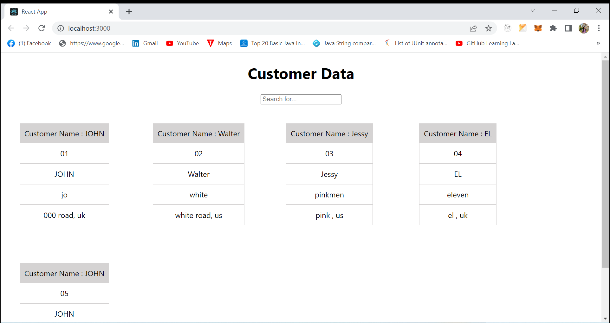
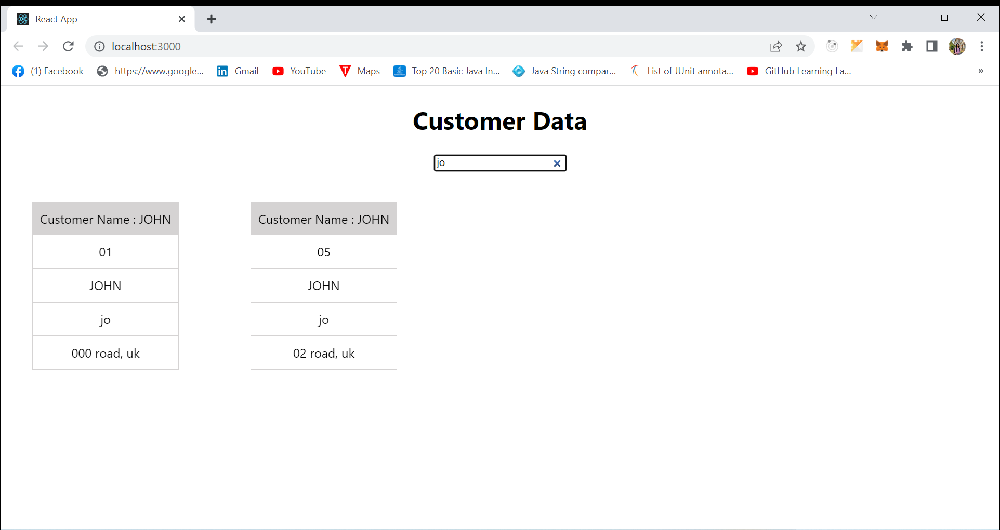

# SearchApp
## Technologies used
It is a web application that built on React, React Hooks.
It also uses JS and CSS.
For unit testing Jest and React testing-library is used.

## Application description
Fetches stubbed data(JSON file), Displays all the customer data.
There is a provision to search a particular customer details by entering the required information into the search bar.
When there is a search word on the search bar will display the corresponding the search details. 

## Screenshots

Home Page

Searched Result

